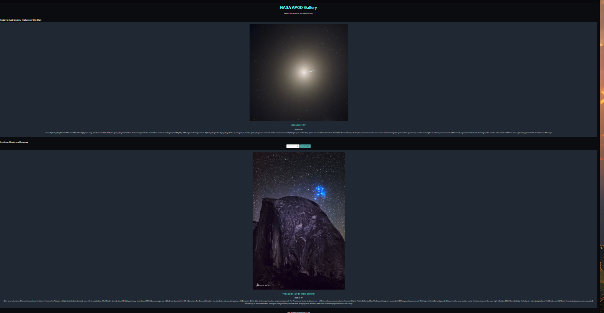

# NASA APOD Gallery



Welcome to the **NASA APOD Gallery**—a dynamic, interactive project that brings the wonders of space right to your browser! This project leverages NASA’s Astronomy Picture of the Day (APOD) API to fetch and display stunning space imagery, complete with detailed explanations, titles, and dates.

## Table of Contents
- [Overview](#overview)
- [Features](#features)
- [Tech Stack](#tech-stack)
- [Installation](#installation)
- [Usage](#usage)
- [Showcasing My Skills](#showcasing-my-skills)
- [License](#license)

## Overview

The NASA APOD Gallery is more than just a collection of beautiful images—it's a showcase of creativity, technical prowess, and a deep passion for both space and front-end development. Designed from the ground up using only Vanilla JavaScript, HTML, and CSS, this project demonstrates the power of clean, modular code paired with a stunning, responsive design.

## Features

- **Daily APOD Display:**  
  Automatically fetches and displays today's Astronomy Picture of the Day, complete with its title, date, and explanation.

- **Historical Exploration:**  
  Use the date picker to explore past APOD entries, diving into a rich archive of space imagery and fascinating scientific insights.

- **Responsive Design:**  
  Crafted with a mobile-first mindset, ensuring a seamless and visually appealing experience on devices of all sizes.

- **User-Friendly Interactions:**  
  Thoughtfully designed controls and smooth transitions make exploring the cosmos both fun and intuitive.

- **Robust Error Handling:**  
  Graceful handling of edge cases (like videos or invalid dates) keeps the experience smooth and engaging.

## Tech Stack

- **HTML5:** Semantic markup for structure and accessibility.
- **CSS3:** Modern, responsive design with Flexbox and custom animations.
- **Vanilla JavaScript:** Clean, modular code for dynamic API integration and DOM manipulation.

## Installation

To set up the project locally:

1. **Clone the Repository:**
   ```bash
   git clone https://github.com/yourusername/nasa-apod-gallery.git
   ```
2. **Navigate to the Project Directory:**
   ```bash
   cd nasa-apod-gallery
   ```
3. **Open `index.html` in Your Browser:**
   No additional dependencies or build steps are required!

## Usage

Upon launching the project:
- **Today's APOD:** The current day's space image, along with its details, loads automatically.
- **Historical Mode:** Select any past date using the date picker and click "Load Image" to view the corresponding APOD.
- **Interactive Experience:** Enjoy smooth transitions, responsive layouts, and a visually engaging UI that makes exploring space an immersive experience.

## Showcasing My Skills

This project is a vibrant demonstration of my capabilities as a front-end developer:
- **API Integration:** Seamlessly connects to NASA’s APOD API, fetching live data and handling asynchronous operations.
- **Responsive & Adaptive Design:** Utilizes CSS best practices to ensure a stunning, mobile-friendly interface.
- **Clean Code:** Written in Vanilla JavaScript, the code is modular, well-documented, and easy to extend—perfect for maintaining and scaling future projects.
- **Creative Problem Solving:** Balances technical challenges with an eye for design, resulting in a project that is as functional as it is beautiful.
- **Passion & Attention to Detail:** Every element is crafted with care, ensuring a polished product that reflects both technical acumen and creative flair.

Recruiters will appreciate not only the robust technical foundation but also the artistic vision and commitment to excellence showcased throughout this project.

## License

This project is open source and available under the [MIT License](LICENSE).

---

Explore, enjoy, and feel free to contribute! Let's keep reaching for the stars—both in code and in the cosmos.
```